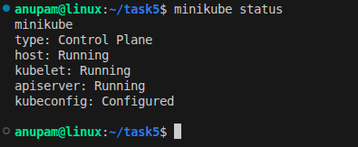
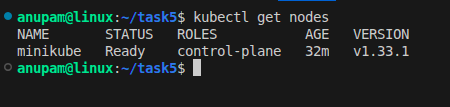
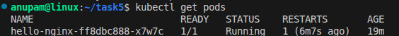
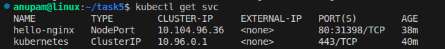
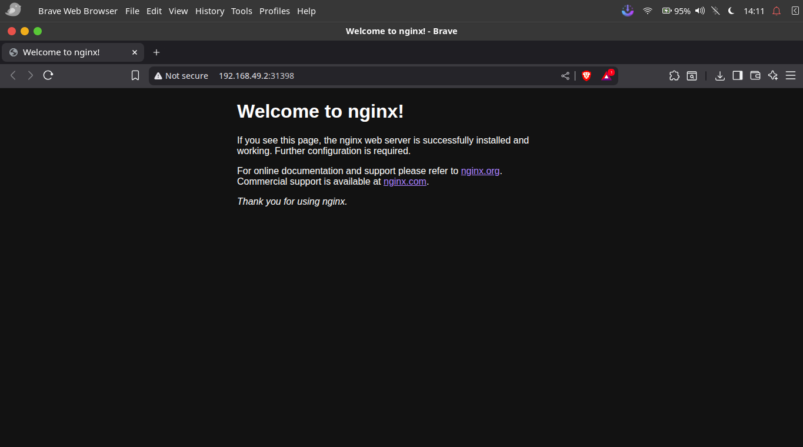
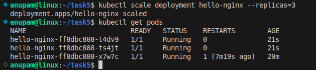
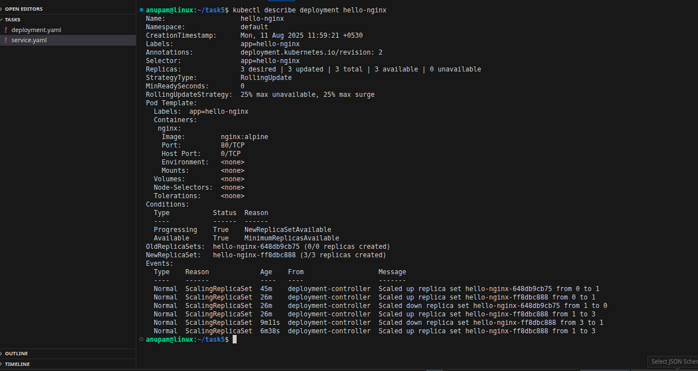

# 🚀 Task 5 - Kubernetes Deployment on Minikube

This project demonstrates deploying an Nginx application to a local Kubernetes cluster using **Minikube**, exposing it via a **NodePort** service, and scaling it using `kubectl`.

---

## 📋 Prerequisites

- Ubuntu (Budgie or similar)
- [Docker](https://docs.docker.com/engine/install/)
- [Minikube](https://minikube.sigs.k8s.io/docs/start/)
- [kubectl](https://kubernetes.io/docs/tasks/tools/)
- VS Code with Kubernetes/Docker/YAML extensions (optional)

---

## 📂 Files

- `deployment.yaml` – Kubernetes Deployment manifest for Nginx.
- `service.yaml` – Kubernetes NodePort Service manifest.
- `README.md` – This documentation.

---

## ⚙️ Steps to Deploy

### 1️⃣ Start Minikube
```bash
minikube start --driver=docker --memory=4096 --cpus=2
```

Verify:
```bash
minikube status
kubectl get nodes
```

---

### 2️⃣ Apply Deployment & Service
```bash
kubectl apply -f deployment.yaml
kubectl apply -f service.yaml
```

Check resources:
```bash
kubectl get pods
kubectl get svc
```

---

### 3️⃣ Access Application in Browser
Get the service URL:
```bash
minikube service hello-nginx --url
```
Example output:
```
http://192.168.49.2:31398
```
Open in browser or:
```bash
xdg-open http://192.168.49.2:31398
```
You should see the **Nginx Welcome Page**.

---

### 4️⃣ Scale the Deployment
```bash
kubectl scale deployment hello-nginx --replicas=3
kubectl get pods
```
You should now see **3 pods** running.

---

## 📸 Screenshot Checklist for Submission

### 1. minikube status


### 2. kubectl get nodes


### 3. kubectl get pods


### 4. kubectl get svc 


### 5. Nginx welcome page from Minikube URL


### 6. kubectl scale deployment hello-nginx --replicas=3 + kubectl get pods showing 3 pods


### 7. kubectl describe deployment hello-nginx


---

## 🧹 Clean Up (Optional)
```bash
kubectl delete -f service.yaml
kubectl delete -f deployment.yaml
minikube stop
```

---

## 📜 License
This project is for educational purposes as part of Task 5 DevOps/Kubernetes training.
